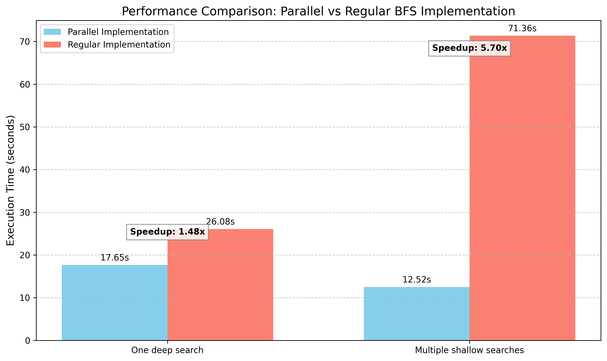

# Никифоров Лука, группа 24151

## Откуда задача
Я изучаю графы Кэли, порожденные тройками префикс-реверсалов -- перестановки которые "разворачивают" первые k элементов. Например r_k = (1, k)(2, k-1)(3, k-2)...(k/2, k/2+1).
В частности -- я ищу тройки префикс-реверсалов через которые можно выразить любую перестановку. Чтобы доказать что конкретная тройка реверсалов порождает все возможные перестановки достаточно доказать что они порождают цикл длинны n и транспозицию двух соседних элементов в этом цикле. Для этого я написал программу на C++ которая по сути просто делала поиск в ширину пока не находила перестановку нужного вида.

Подробнее если интересно можно почитать в [готовящейся для публикации статье](https://arxiv.org/abs/2511.16959)

## Что я сделал параллельно-программистсткое
В качестве работы по параллельному программированию я реализовал параллельный BFS. Код конкретно параллельного bfs можно посмотреть в файле `main.cpp` в функции `parallel_bfs`(285 строчка). Бенчмарки приведены на картинке ниже.



Первые два столбика -- случай когда нужная перестановка находится глубоко в дереве поиска.

Вторые два столбика -- запускает порядка 1000 bfs для разных размерностей n. Для каждой размерности n нужная перестановка находится на низкой глубине -- не больше 6. Bfs для каждого отдельного n запускается последовательно даже в параллельном случае!! То есть параллельно запускается только каждый отдельно взятый bfs.

## Как возпроизвести результаты

Скомпилировать файлики:
```
g++ regular_benchmark.cpp -o regular_benchmark
g++ -pthread parallel_benchmark.cpp -o parallel_benchmark
```

Замерить время какой-нибудь утилитой(я использовал [hyperfine](https://github.com/sharkdp/hyperfine))
```
hyperfine --runs 5 './parallel_benchmark 1 -2 5 10 11 2'
hyperfine --runs 5 './regular_benchmark 1 -2 5 10 11 2'
hyperfine --runs 5 './parallel_benchmark 0 -3 11 13 2500 6'
hyperfine --runs 5 './regular_benchmark 0 -3 11 13 2500 6'
```

Если у вас `zsh` как у меня, то потом просто скопировать результаты из терминала в файлик `benchresults.txt` и запустить `plots.py`. Если нет -- то подогнать формат вывода под тот который сейчас в файле или подредактировать скрипт который генерирует график.
